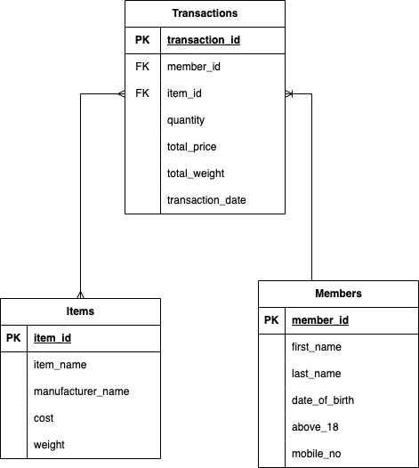

# Documentation

## Task overview

This section requires a database infrastructure to be created for a sales transaction system for an e-commerce company. The task is to create a PostgreSQL database infrastructure using the Docker image and is expected to capture the details of purchases made by members on the website.

## Database Design

The database consists of 3 tables:

1. Members table: Stores details of members, including membership ID and other relevant information.
2. Items table: Stores details of items listed for sale on the website, including Item Name, Manufacturer name, Cost, and Weight (in kg).
3. Transactions table: Stores details of each transaction made by a member, including membership ID, Items bought, total items price, and total items weight. A member can make multiple transactions, so this table will have a  foreign key referencing the members table. A transaction can contain multiple items, so this table also has a foreign key referencing the items table.

## Entity-Relationship Diagram (ERD)

The ER Diagram represents the data entities required and their relationships used to design the database. 



## Dockerfile

Docker is a platform that allows developers to build, package, and deploy applications in a containerized format. This is the script to create the Dockerfile to build the database image.

```jsx
FROM postgres
ENV POSTGRES_PASSWORD=password
ENV POSTGRES_DB=ecommerce
COPY schema.sql /docker-entrypoint-initdb.d/
```

After creating the dockerfile and schema.sql files, we do the following:

1. Assuming we have the PostgresSQL Docker image by running: docker pull postgres
2. Build the docker image: docker build -t ecommerce-db .
    1. This will build a docker image named ‘ecommerce-db’ based on the Dockerfile specified in the current directory
3. Run docker container: docker run -p 5432:5432 -d ecommerce-db
    1. This will start a docker container from the ‘ecommerce-db’ image and map the container’s port 5432 to the host’s port 5432.

## DDL Statements

The following are the SQL statements to use to create the necessary tables

```jsx
CREATE TABLE IF NOT EXISTS members (
  members_id VARCHAR(255) PRIMARY KEY,
  first_name VARCHAR(255) NOT NULL,
  last_name VARCHAR(255) NOT NULL,
  date_of_birth DATE NOT NULL,
  above_18 BOOLEAN NOT NULL,
  email VARCHAR(50) UNIQUE NOT NULL,
  mobile_no VARCHAR(8) NOT NULL
);

CREATE TABLE IF NOT EXISTS items (
  item_id SERIAL PRIMARY KEY,
  item_name VARCHAR(255) NOT NULL,
  manufacturer_name VARCHAR(255) NOT NULL,
  cost DECIMAL(10,2) NOT NULL,
  weight DECIMAL(10,2) NOT NULL
);

CREATE TABLE IF NOT EXISTS transactions (
  transaction_id SERIAL PRIMARY KEY,
  member_id INTEGER NOT NULL REFERENCES members(id),
  item_id INTEGER NOT NULL REFERENCES items(id),
  quantity INTEGER NOT NULL,
  total_price DECIMAL(10,2) NOT NULL,
  total_weight DECIMAL(10,2) NOT NULL,
  transaction_date TIMESTAMP DEFAULT NOW()
);
```

### SQL Queries

The following are the SQL queries to answer the following questions:

1. Which are the top 10 members by spending
2. Which are the top 3 items that are frequently bought by members

### Which are the top 10 members by spending

```jsx
SELECT m.member_id, SUM(t.total_price) AS total_spending
FROM transactions t
JOIN members m ON t.member_id = m.member_id
GROUP BY m.member_id
ORDER BY total_spending DESC
LIMIT 10;
```

### Which are the top 3 items that are frequently bought by members

```jsx
SELECT i.item_name, COUNT(t.item_id) AS frequency
FROM transactions t
JOIN items i ON t.item_id = i.item_id
GROUP BY i.item_name
ORDER BY frequency DESC
LIMIT 3;
```
