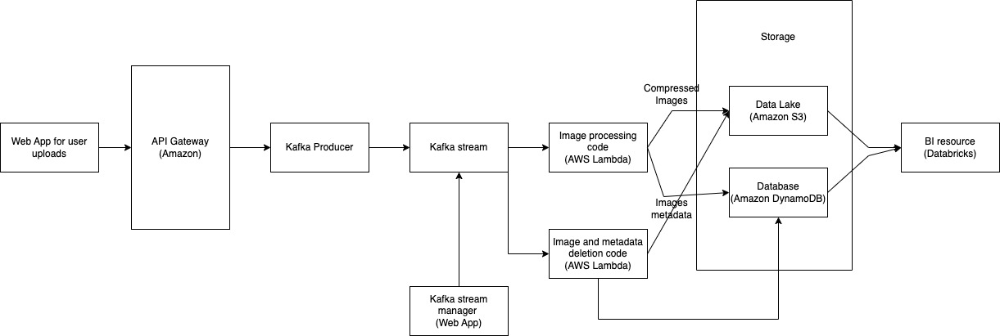

# Documentation

## Task Overview

This section requires the system design of a company whose main business is processing images. The architecture is designed for the cloud environment and includes an API web application for user image uploads, a separate web application for hosting a Kafka stream for image uploads, and a cloud-hosted Business Intelligence (BI) resource for image data analysis. The system is designed to store image data and metadata for 7 days for archival purposes and then purge it from the environment for compliance and privacy.

## Assumptions

These are the assumptions made in the design of the architecture.

1. The image files uploaded are not too large to be processed in real time by kafka stream and the image processing code.
2. The image processing code written includes image compression, such that the images are efficiently stored.
3. The API system uses Amazon’s API Gateway, is already in place and can be integrated with the cloud environment.
4. The engineers will have access to the web application for managing the kafka stream and will be able to configure and monitor the stream as needed from the web application.
5. The cloud environment will have sufficient capacity to handle the expected volume of image uploads and processing.
6. The kafka stream will be hosted on the same cloud environment as the image processing code and BI resource for each of management and integration.
7. The S3 bucket is mounted onto the Databricks cluster.
8. Deleting the image files and metadata from the sources (S3 and database), will make the mount invalid. (No more access)
9. The API Gateway and security policies in place are sufficient to protect the system from unauthorized access and attacks.

## System Design Architecture Diagram

The system architecture diagram below provides an overview of the end-to-end flow of the system.



## Architecture Components

These are the components and their descriptions as it relates to the architecture diagram above.

### Web App for image uploads

A web application that allows users to upload images to the cloud using an API.

### API Gateway (Amazon)

This gateway allows users to upload images to the environment via REST API. The Amazon API gateway is used for this. This service also enforces authentication and security policies before allowing any data transfer.

### Kafka Producer

This is a web application that generates image upload events and sends them to the Kafka cluster. This allows it to receive images and publish an event to the kafka stream to notify consumers listening that there is an image upload event. The image files are uploaded to file system and their URIs(paths) are stored in the kafka message. This is so that the kafka message size is relatively smaller, increasing throughput.

```sql
# Example of json message
{
   "timestamp": 1652699471,
   "image_path": "/path/to/image/camera.png",
}
```

### Kafka Web App Stream

The kafka stream enables real-time processing of the images. It receives events (image uploads) from the Kafka producer and distributes them to multiple Kafka consumers that are subscribed to specific Kafka topics. The Kafka stream enables event-driven architecture which makes it easier to scale and manage the processing of large volumes of data in real-time.

### Image processing code (AWS Lambda)

The code written by the company's software engineers to process the images. This code is executed automatically by Lambda in response to incoming events. The code can include image compression, resizing, and any other custom processing logic required by the business.

### Image and metadata deletion (AWS Lambda)

This code is responsible for purging images and their metadata from the data lake (S3 storage) and Database (Amazon DynamoDB) respectively after 7 days. The code is also hosted on AWS lambda and executed using a scheduled event (cronjob). This ensures that compliance and privacy requirements are met.

### Data Lake (Amazon S3)

Implemented using Amazon S3, the data lake is a centralized storage repository that is used to store files, and in this case more specifically image files.

### Database (Amazon DynamoDB)

Implemented using Amazon DynamoDB, the database is used to store metadata associated with the images uploaded to the data lake. Amazon DynamoDB is a highly scalable NoSQL database that enables the storage and retrieval of large volumes of data with low latency.

### BI resource (Databricks)

This is the Business Intelligence resource used by the company’s analysts to access and perform analytical computation on data stored. We use Databricks here as it is a unified analytics platform that includes a lot of useful features for analytical tasks. The S3 bucket is mounted onto the Databricks cluster and this allows analysts to perform analytical computations on the data stored in the S3 bucker without the need for manual data transfer between the two platforms. This improves efficiency and reduces the risk of data inconsistencies and errors that can occur during manual data transfer.
